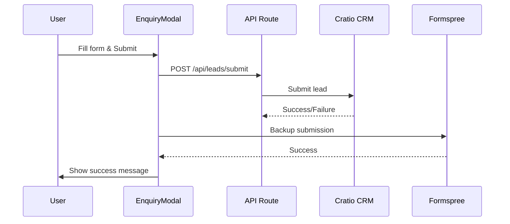
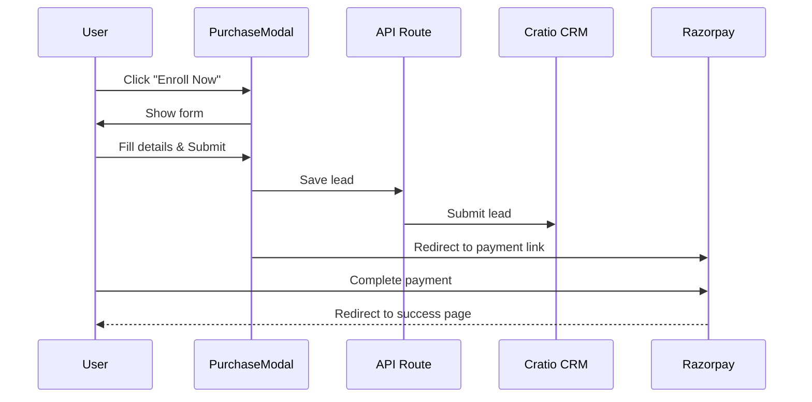

# Linkway Learning - API Integration Guide

This guide explains how to set up and use the Cratio CRM and Razorpay integrations for lead capture and course purchases.

## Table of Contents

1. [Overview](#overview)
2. [Cratio CRM Integration](#cratio-crm-integration)
3. [Razorpay Payment Integration](#razorpay-payment-integration)
4. [Testing](#testing)
5. [Troubleshooting](#troubleshooting)

---

## Overview

### What's Integrated

✅ **Lead Capture Form** → Cratio CRM API + Formspree (backup)
- Used for: Course inquiries, syllabus downloads, general queries
- Modal: `EnquiryModal`
- Trigger: "Download Syllabus", "Get in Touch", etc.

✅ **Course Purchase** → Razorpay Payment Link
- Used for: Course enrollment and payment
- Modal: `PurchaseModal`
- Trigger: "Enroll Now" button
- Payment Link: `https://rzp.io/rzp/linkwaylearning`

---

## Cratio CRM Integration

### Step 1: Get API Credentials

Contact Cratio CRM to obtain your API credentials:

**Support:**
- Email: support@cratio.com
- Website: support.cratio.com

**Required Information:**
1. API Endpoint URL (e.g., `https://api.cratio.com/v1/leads`)
2. API Key / Authentication Token
3. Field mapping documentation (which field names to use)

### Step 2: Configure Environment Variables

1. Copy `.env.example` to `.env.local`:
```bash
cp .env.example .env.local
```

2. Add your Cratio credentials to `.env.local`:
```env
NEXT_PUBLIC_CRATIO_API_URL=https://api.cratio.com/v1/leads
CRATIO_API_KEY=your_actual_api_key_here
```

### Step 3: Update Field Mappings (If Needed)

Open `src/lib/api/cratio.ts` and update the field mappings based on your Cratio CRM configuration:

```typescript
const cratioPayload = {
  // Update these field names to match your Cratio CRM
  lead_name: leadData.fullName,    // might be "name" or "full_name"
  email: leadData.email,
  phone: leadData.phone,
  // ... other fields
};
```

### Step 4: Test with CURL

Test your API integration using curl:

```bash
curl -X POST https://api.cratio.com/v1/leads \
  -H "Content-Type: application/json" \
  -H "Authorization: Bearer YOUR_API_KEY" \
  -d '{
    "lead_name": "Test User",
    "email": "test@example.com",
    "phone": "+919876543210",
    "interested_course": "Data Analytics",
    "lead_source": "website"
  }'
```

**Check the response to understand:**
- The exact field names Cratio expects
- The response format
- Error handling patterns

### Common Authentication Methods

The integration supports three common authentication methods:

#### Method 1: Bearer Token (Default)
```typescript
headers: {
  "Authorization": "Bearer YOUR_API_KEY"
}
```

#### Method 2: API Key Header
```typescript
headers: {
  "X-API-Key": "YOUR_API_KEY"
}
```

#### Method 3: API Key in URL
```typescript
url: `https://api.cratio.com/v1/leads?api_key=YOUR_API_KEY`
```

Edit `src/lib/api/cratio.ts` to use the method that works with your Cratio setup.

### How It Works



---

## Razorpay Payment Integration

### Current Implementation: Static Payment Link

The simplest implementation (currently active) uses a single Razorpay payment link for all courses:

**Payment Link:** `https://rzp.io/rzp/linkwaylearning`

### How It Works

1. User clicks "Enroll Now" on any course page
2. `PurchaseModal` opens asking for:
   - Full Name
   - Email
   - Phone Number
3. On submit:
   - Lead data is saved to Cratio CRM
   - User is redirected to Razorpay payment page
   - User completes payment on Razorpay

### Code Location

- Implementation: `src/lib/api/razorpay.ts`
- Modal: `src/components/forms/PurchaseModal.tsx`
- Usage: `src/components/sections/CoursePageTemplate.tsx`

### Payment Flow



### Advanced: Dynamic Payment Links (Optional)

For per-course pricing or pre-filled customer data, you can implement dynamic payment links using Razorpay API.

**Requirements:**
1. Razorpay API credentials (Key ID & Secret)
2. Backend API endpoint to create payment links
3. Webhook to handle payment success/failure

**Setup:**

1. Add to `.env.local`:
```env
RAZORPAY_KEY_ID=rzp_live_xxxxx
RAZORPAY_KEY_SECRET=your_secret_key
```

2. Install Razorpay SDK:
```bash
npm install razorpay
```

3. Create API endpoint at `src/app/api/payments/create-link/route.ts`:

```typescript
import Razorpay from 'razorpay';
import { NextRequest, NextResponse } from 'next/server';

const razorpay = new Razorpay({
  key_id: process.env.RAZORPAY_KEY_ID!,
  key_secret: process.env.RAZORPAY_KEY_SECRET!,
});

export async function POST(request: NextRequest) {
  try {
    const body = await request.json();

    const paymentLink = await razorpay.paymentLink.create({
      amount: body.amount, // in paise
      currency: 'INR',
      description: body.description,
      customer: {
        name: body.customer.name,
        email: body.customer.email,
        contact: body.customer.contact,
      },
      notify: {
        sms: true,
        email: true,
      },
      reminder_enable: true,
      callback_url: `${process.env.NEXT_PUBLIC_BASE_URL}/payment/success`,
      callback_method: 'get'
    });

    return NextResponse.json(paymentLink);
  } catch (error) {
    return NextResponse.json(
      { error: 'Failed to create payment link' },
      { status: 500 }
    );
  }
}
```

4. Update `PurchaseModal.tsx` to use dynamic links:

```typescript
// In handleProceedToPayment function:
const result = await createDynamicPaymentLink({
  courseName,
  studentName: formData.fullName,
  email: formData.email,
  phone: formData.phone,
  amount: coursePrice,
});

if (result.success && result.paymentLink) {
  window.open(result.paymentLink, '_blank');
}
```

---

## Testing

### Testing Lead Capture

1. **Local Development:**
```bash
npm run dev
```

2. **Open any page and click "Download Syllabus" or "Get in Touch"**

3. **Fill and submit the enquiry form**

4. **Check your Cratio CRM dashboard** to see if the lead appears

5. **Check Formspree** (backup) at: https://formspree.io/

### Testing Course Purchase

1. **Open any course page** (e.g., `/courses/data-analytics`)

2. **Click "Enroll Now"**

3. **Fill the purchase form**

4. **You'll be redirected to Razorpay** payment page

5. **Use Razorpay test cards** (if in test mode):
   - Success: `4111 1111 1111 1111`
   - Failure: `4111 1111 1111 1234`

### Testing API Endpoints

Test the lead submission API directly:

```bash
curl -X POST http://localhost:3000/api/leads/submit \
  -H "Content-Type: application/json" \
  -d '{
    "fullName": "Test User",
    "email": "test@example.com",
    "phone": "+919876543210",
    "course": "Data Analytics",
    "background": "Working Professional",
    "source": "website_enquiry"
  }'
```

---

## Troubleshooting

### Cratio CRM Integration Issues

#### Issue: "CRM API not configured" error
**Solution:** Make sure you've added `NEXT_PUBLIC_CRATIO_API_URL` and `CRATIO_API_KEY` to `.env.local`

#### Issue: "API Error: 401 Unauthorized"
**Solution:**
- Check if your API key is correct
- Verify the authentication method (Bearer token vs API key header)
- Contact Cratio support to verify your API access

#### Issue: "API Error: 400 Bad Request"
**Solution:**
- Check field names in `src/lib/api/cratio.ts`
- Compare with Cratio's API documentation
- Test with curl to see exact error message

#### Issue: Leads not showing in Cratio CRM
**Solution:**
- Check browser console for errors
- Check server logs: `npm run dev` (look for API errors)
- Verify Formspree is receiving leads (backup system)
- Test API with curl directly

### Razorpay Integration Issues

#### Issue: Payment link not opening
**Solution:**
- Check browser console for errors
- Verify popup blocker isn't blocking the window
- Test the payment link directly: https://rzp.io/rzp/linkwaylearning

#### Issue: Wrong course price showing
**Solution:**
- Update `coursePricing` in `src/lib/api/razorpay.ts`
- Ensure course name matches exactly

### General Debugging

Enable detailed logging in development:

```typescript
// In src/lib/api/cratio.ts
console.log('Submitting to Cratio:', cratioPayload);
console.log('Cratio response:', await response.json());
```

Check the Network tab in browser DevTools:
1. Open DevTools (F12)
2. Go to Network tab
3. Submit form
4. Look for `/api/leads/submit` request
5. Check request payload and response

---

## Support

- **Cratio CRM:** support@cratio.com or support.cratio.com
- **Razorpay:** https://razorpay.com/support/
- **Development Issues:** Check the code comments in:
  - `src/lib/api/cratio.ts`
  - `src/lib/api/razorpay.ts`
  - `src/app/api/leads/submit/route.ts`

---

## Summary

✅ **Enquiry Form** → Cratio CRM + Formspree backup
✅ **Purchase Form** → Razorpay payment link
✅ **All modals integrated** in the website
✅ **Fallback systems** in place
✅ **Ready to deploy** once API credentials are added

**Next Steps:**
1. Get Cratio CRM API credentials
2. Add credentials to `.env.local`
3. Test locally
4. Deploy to production
